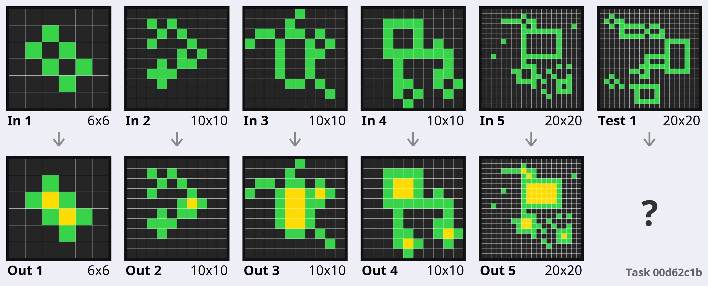

# arckit

[](https://badge.fury.io/py/arckit)


Python and command-line tools for easily working with the **Abstraction &amp; Reasoning Corpus** (ARC) dataset. 

```bash
pip install arckit
```

Arckit provides tools for loading the data in a friendly format (without a separate download!), visualizing the data with high-quality vector graphics, and evaluating models on the dataset.

## 🐍 Python API
...

## 💻 Command-line tools

`arcsave` saves a visualisation of a specific task to a file (pdf/svg/png), and is useful for inspecting tasks or producing high quality graphics showing specific tasks (e.g. for a paper). Tasks can be specified by their hex ID or by dataset, e.g. `train0`.

```bash
usage: arcsave [-h] [--output OUTPUT] task_id width height

Save a task to a image file.

positional arguments:
  task_id          The task id to save. Can either be a task ID or a string e.g. `train0`
  width            The width of the output image
  height           The height of the output image

optional arguments:
  -h, --help       show this help message and exit
  --output OUTPUT  The output file to save to. Must end in .svg/.pdf/.png. By default, pdf is used.
  ```



`arcshow` draws a visualisation of a specific task straight to the console:


## 💡 Contributions

Any relevant contributions are very welcome! Please feel free to open an issue or pull request, or drop me an email if you want to discuss any possible changes.

## 📜 Acknowledgements

The ARC dataset was graciously released by Francois Chollet under [Apache 2.0](https://github.com/fchollet/ARC/blob/master/LICENSE) and can be found in original format in [this repository](https://github.com/fchollet/ARC). The dataset is reproduced within the `arckit` package under the same license.