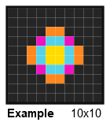

# arckit

[](https://badge.fury.io/py/arckit)


Python and command-line tools for easily working with the **Abstraction &amp; Reasoning Corpus** (ARC) dataset. 

```bash
pip install arckit
```

Arckit provides tools for loading the data in a friendly format (without a separate download!), visualizing the data with high-quality vector graphics, and evaluating models on the dataset.

## 🐍 Python API

### Loading the dataset

```python
>>> import arckit
>>> train_set, eval_set = arckit.load_data() # Load ARC1 train/eval

# TaskSets are iterable and indexable
>>> train_set 
<TaskSet: 400 tasks>
>>> train_set[0]
<Task-train 007bbfb7 | 5 train | 1 test>

# Indexing can be done by task ID
>>> train_set[0] == train_set['007bbfb7']
True

# You can load specific tasks by ID
>>> task = arckit.load_task('007bbfb7')
```

### Interacting with tasks

```python
>>> task.dataset
'train'
>>> task.id
'007bbfb7'

## Extracting task Grids
>>> task.train # o task.test
=>  List[Tuple[ndarray, ndarray]] # of input/output pairs

>>> task.train[0][0] # input of 1st train example
array([[0, 7, 7],
       [7, 7, 7],
       [0, 7, 7]])

# Tasks can be previewed (with colour!) in Python.
>>> train_set[15].show()
                                <Task-train 0d3d703e | 4 train | 1 test>
┏━━━━━━━━━━┳━━━━━━━━━━━┳━━━━━━━━━━┳━━━━━━━━━━━┳━━━━━━━━━━┳━━━━━━━━━━━┳━━━━━━━━━━┳━━━━━━━━━━━┳━━┳━━━━━━━━┓
┃ A-in 3x3 ┃ A-out 3x3 ┃ B-in 3x3 ┃ B-out 3x3 ┃ C-in 3x3 ┃ C-out 3x3 ┃ D-in 3x3 ┃ D-out 3x3 ┃  ┃ TA-in  ┃
┡━━━━━━━━━━╇━━━━━━━━━━━╇━━━━━━━━━━╇━━━━━━━━━━━╇━━━━━━━━━━╇━━━━━━━━━━━╇━━━━━━━━━━╇━━━━━━━━━━━╇━━╇━━━━━━━━┩
│  3 1 2   │   4 5 6   │  2 3 8   │   6 4 9   │  5 8 6   │   1 9 2   │  9 4 2   │   8 3 6   │  │ 8 1 3  │
│  3 1 2   │   4 5 6   │  2 3 8   │   6 4 9   │  5 8 6   │   1 9 2   │  9 4 2   │   8 3 6   │  │ 8 1 3  │
│  3 1 2   │   4 5 6   │  2 3 8   │   6 4 9   │  5 8 6   │   1 9 2   │  9 4 2   │   8 3 6   │  │ 8 1 3  │
└──────────┴───────────┴──────────┴───────────┴──────────┴───────────┴──────────┴───────────┴──┴────────┘

# Get task in original ARC format following fchollet's repo.
>>> task.to_dict()
=>  {
    "id": str,
    "train": List[{"input": List[List[int]], "output": List[List[int]]}],
    "test":  List[{"input": List[List[int]], "output": List[List[int]]}]
    }
```

### Scoring a submission file:

To evaluate a submission in [Kaggle ARC format](https://www.kaggle.com/competitions/abstraction-and-reasoning-challenge/overview/evaluation):

```python
>>> eval_set.score_submission(
    'submission.csv', # Submission with two columns output_id,output in Kaggle fomrat
    topn=3,           # How many predictions to consider (default: 3)
    return_correct=False # Whether to return a list of which tasks were solved
    )
```

## 🖼️ Creating visualisations

The `arckit.vis` submodule provides useful functions for creating vector graphics visualisations of tasks, using the `drawsvg` module. The docstrings for these functions provide more detailed information as well as additional options.

```python
>>> import arckit.vis as vis
>>> grid = vis.draw_grid(task.train['2013d3e2'][0], xmax=3, ymax=3, padding=.5, label='Example')
>>> vis.output_drawing(grid, "images/grid_example.png") # svg/pdf/png
```



When drawing tasks, arckit will intelligently resize all of the grids such that the total size of the illustration does not exceed the chosen width/height.

```python
>>> task = vis.draw_task(train_set[0], width=10, height=6, label='Example')
>>> vis.output_drawing(grid, "images/arcshow_example.png") # svg/pdf/png
```


## 💻 Command-line tools

`arcshow` draws a visualisation of a specific task straight to the console:


`arcsave` saves a visualisation of a specific task to a file (pdf/svg/png), and is useful for inspecting tasks or producing high quality graphics showing specific tasks (e.g. for a paper). Tasks can be specified by their hex ID or by dataset, e.g. `train0`.

```bash
usage: arcsave [-h] [--output OUTPUT] task_id width height

Save a task to a image file.

positional arguments:
  task_id          The task id to save. Can either be a task ID or a string e.g. `train0`
  width            The width of the output image
  height           The height of the output image

optional arguments:
  -h, --help       show this help message and exit
  --output OUTPUT  The output file to save to. Must end in .svg/.pdf/.png. By default, pdf is used.
  ```


## 💡 Contributions

Any relevant contributions are very welcome! Please feel free to open an issue or pull request, or drop me an email if you want to discuss any possible changes.

## 📜 Acknowledgements

The ARC dataset was graciously released by Francois Chollet under [Apache 2.0](https://github.com/fchollet/ARC/blob/master/LICENSE) and can be found in original format in [this repository](https://github.com/fchollet/ARC). The dataset is reproduced within the `arckit` package under the same license.